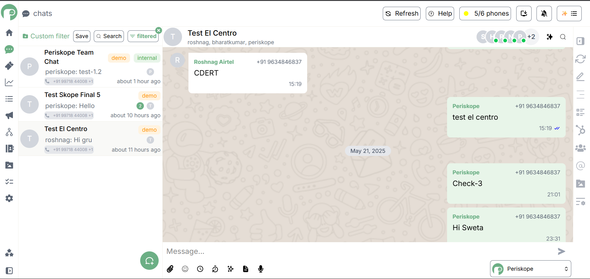

# Periskope Chat Application

A real-time chat application built with Next.js and Supabase, featuring a modern and intuitive user interface.

Checkout the live site [here](https://periscopeassignment.onrender.com/login) !



## Features

- 🔐 User Authentication with Supabase
- 💬 Real-time Chat Functionality
- 🎨 Modern UI with Tailwind CSS
- 🔄 Real-time Updates
- 👤 User Profiles
- 🏷️ Message Tagging
- 📊 Conversation Management

## Tech Stack

- **Frontend**: Next.js 15.3.2, React 19
- **Styling**: Tailwind CSS
- **Authentication**: Supabase Auth
- **Database**: Supabase
- **State Management**: React Context
- **Date Handling**: date-fns
- **Icons**: react-icons
- **TypeScript** for type safety

## Prerequisites

- Node.js (Latest LTS version recommended)
- npm or yarn
- Supabase account and project

## Environment Variables

Create a `.env` file in the root directory with the following variables:

```env
NEXT_PUBLIC_SUPABASE_URL=your_supabase_url
NEXT_PUBLIC_SUPABASE_ANON_KEY=your_supabase_anon_key
```

## Installation

1. Clone the repository:
```bash
git clone <repository-url>
cd periscope-assignment
```

2. Install dependencies:
```bash
npm install
# or
yarn install
```

3. Run the development server:
```bash
npm run dev
# or
yarn dev
```

4. Open [http://localhost:3000](http://localhost:3000) in your browser.

## Project Structure

```
├── public/          # Static files
├── src/
│   ├── app/        # Next.js app directory
│   ├── components/ # React components
│   ├── context/    # React context providers
│   ├── lib/        # Utility functions and configurations
│   └── images/     # Image assets
├── supabase/       # Supabase configurations
└── ...config files
```

## Available Scripts

- `npm run dev` - Start development server
- `npm run build` - Build for production
- `npm run start` - Start production server
- `npm run lint` - Run ESLint

## Contributing

1. Fork the repository
2. Create your feature branch (`git checkout -b feature/amazing-feature`)
3. Commit your changes (`git commit -m 'Add some amazing feature'`)
4. Push to the branch (`git push origin feature/amazing-feature`)
5. Open a Pull Request

## License

This project is licensed under the MIT License - see the LICENSE file for details.
